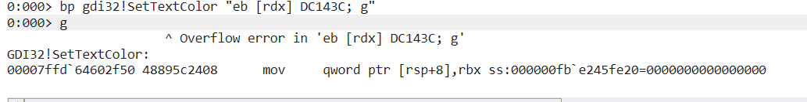
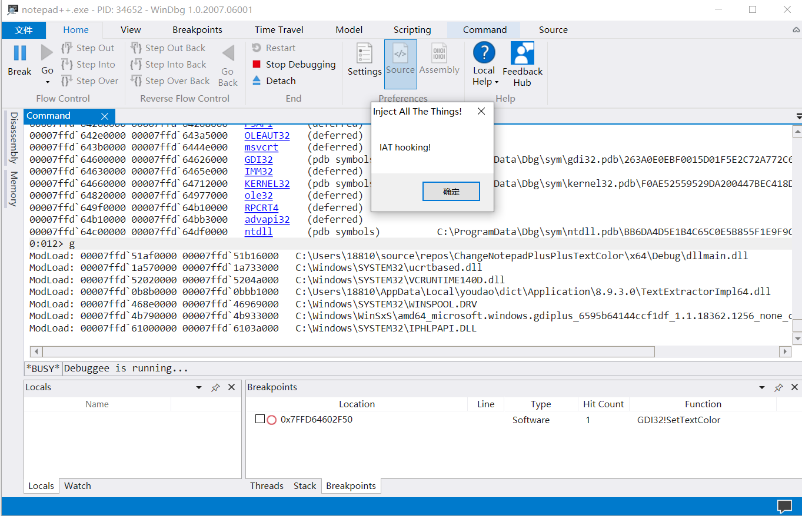

# 实验：改变notepad++的字体颜色

## 实验要求

+ 选任何一款软件，基于以下两种技术进行软件行为的篡改

  + [x] 基于`windebug`进行

  + [x] 基于`dll、API/iat hook`来改

## 实验过程

### 第一步：查看导入表，初步筛选可改变字体颜色的函数

1、找到notepad++程序的位置，查看[导入表](./notepad++_imports.txt)。

```
1、notepad++程序的位置：
C:\Windows\System32\notepad.exe

2、查看导入表：
vs powershell 执行：
cd C:\Windows\System32\
dumpbin /imports .\notepad++.exe > D:\notepad_imports.txt
```


2、找到导入表中与颜色有关的API。

```
 GDI32.dll!2A6 SetTextColor
 USER32.dll!17E GetSysColorBrush
 USER32.dll!17E GetSysColor
```

依次对三个与图像相关的函数进行查阅文档:

+ [SetTextColor](https://docs.microsoft.com/en-us/windows/win32/api/wingdi/nf-wingdi-settextcolor)：SetTextColor是对 [TextOut](https://docs.microsoft.com/en-us/windows/desktop/api/wingdi/nf-wingdi-textouta) and [ExtTextOut](https://docs.microsoft.com/en-us/windows/desktop/api/wingdi/nf-wingdi-exttextouta) 两个函数所写的字符进行渲染。

```
COLORREF SetTextColor(
  HDC      hdc,
  COLORREF color
);
```

+ [GetSysColorBrush](https://docs.microsoft.com/en-us/windows/win32/api/winuser/nf-winuser-getsyscolorbrush) ：检索指定颜色对应的全局逻辑刷的句柄。

```
HBRUSH GetSysColorBrush(
  int nIndex
);
```

+ [GetSysColor](https://docs.microsoft.com/en-us/windows/win32/api/winuser/nf-winuser-getsyscolor)：检索指定显示元素的当前颜色。显示元素是窗口和显示在系统显示屏上的部分。

```
DWORD GetSysColor(
  int nIndex
);
```

### 第二步：使用`Windebug`实现篡改notepad++字体颜色的实验

1、学习`Windebug`相关内容，见【附录1】。

2、对函数`SetTextColor`下断点调试，观察是否可以改变字体颜色。

+ 所使用的命令：

  ```
  bp gdi32!SetTextColor  "r rdx = DC143C;g"  
  # 在x64框架下，rdx存放函数的第二个参数。
  # MASM 表达式中：
  # bp 是对于后面的模块里面的gdi32函数SetTextColor下断点；
  # r 命令表示对寄存器的操作；
  # g 是go，即继续执行。 
  ```

+ 效果如下：

  

+ 该过程中遇到如下错误：尝试使用`eb`写入寄存器值时出错。

  

  + `mov qword ptr [rsp+8],rbx` : 该命令的意思是将寄存器`rbx`里面的值写入`rsp+8`。（其原因是：[在 Win64 下，会为每个参数保留一份用来传递的 stack 空间，以便**回写** caller 的 stack](https://blog.csdn.net/a1875566250/article/details/11619637)）
  + 最后采用`r`指令代替`eb`指令。

### 第三步： 基于`dll`、`IAT hook`实现篡改notepad++字体颜色的实验

#### 参考资料

+ `iathook`相关参考代码链接：
  + `https://github.com/m0n0ph1/IAT-Hooking-Revisited`
  + `https://github.com/tinysec/iathook`
+ `dll` 注入相关参考代码链接：
  + `https://github.com/DarthTon/Xenos`
  + `https://github.com/fdiskyou/injectAllTheThings`
+ `apihook`

#### 相关知识学习 

+ `dll`相关知识：见附录2【 `Dll`动态库文件】。

+ API HOOK 和 IAT HOOK 的基本原理：见附录3【从PE文件理解何为IAT hook】。
  + API HOOK:通过`api hook`，改变一个系统`api`的原有功能。基本的方法就是通过`hook`“接触”到需要修改的`api`函数[入口点](https://baike.baidu.com/item/入口点)，改变它的地址指向新的自定义的函数。
  + IAT HOOK: *IAT* 法就是通过修改 *IAT* 表中的函数地址而达到的 *API* 截获的方法。

#### 基本思想

+ `dll`注入：`injectAllTheThings.exe` 接受参数，并根据参数执行，该命令的意思是创建一个线程，将该线程注入到`notepad++.exe`中，该线程加载`dllmain.dll`动态库,并在该线程attach/detach到进程的时候执行一些自定义代码。
+ `IAThook` : 在`dllmain.dll`中的入口函数 `DllMain`中定义线程attach到notepad++.exe的时候改变`notepad++.exe`PE文件的的`IAT`表中指向`SetTextColor`的函数地址改为自定义的函数地址（在此之前先保留正确的`SetTextColor`函数的地址，以便`notepad++.exe`进程结束时将`IAT`表中`SetTextColor`的函数地址恢复到正确）。

#### C++实现

+ [代码链接](./ChangeNotepadPlusPlusTextColor)

  + [dllmain.cpp](./ChangeNotepadPlusPlusTextColor/dllmain/dllmain.cpp)

    ```c
    
    BOOL APIENTRY DllMain( HMODULE hModule,
                           DWORD  ul_reason_for_call,
                           LPVOID lpReserved
    					 )
    {
    	switch (ul_reason_for_call)
    	{
    	case DLL_PROCESS_ATTACH:
    
    		IATHook(
    			GetModuleHandleW(NULL),  //获取当前exe程序基址：If this parameter is NULL, GetModuleHandle returns a handle to the file used to create the calling process (.exe file).
    			(char*)"gdi32.dll",
    			(char*)"SetTextColor",
    			Fake_SetTextColor,
    			&g_hHook_SetTextColor
    		);
    
    		break;
    	case DLL_PROCESS_DETACH:
    
    		UnIATHook(g_hHook_SetTextColor);
    		break;
    	}
    	return TRUE;
    }
    ```

  + [injectAllTheThings](./ChangeNotepadPlusPlusTextColor/injectAllTheThings/main.cpp)

+ 调用方式

  >在`C:\Users\18810\source\repos\ChangeNotepadPlusPlusTextColor\x64\Debug\`[即`injectAllTheThings.exe`的所在路径]中打开`cmd`,执行以下命令，进行`dll`注入：
  >`.\injectAllTheThings.exe -t  1 notepad++.exe C:\Users\18810\source\repos\ChangeNotepadPlusPlusTextColor\x64\Debug\dllmain.dll`

+ 实验效果：

  + 开启notepad++.exe,使用`WinDbg`下检测软件行为，使之暂停，然后调用`injectAllTheThings.exe`进行注入，在`WinDbg`中写入`g`命令使`notepad++.exe`软件继续执行。可以观察到加载了上述所生成的`dllmain.dll`文件，并弹出了一个`IAT hooking`的弹框（这算因为为方便观察现象，在`dllmain.dll`文件中调用了`MessageBoxA`函数来生成弹窗）。

    

  

## 附录

###  附录1 `Windebug`学习

#### 基础命令

+ `lm` :查看所有的模块，以及模块信息。

  如图 : 

  

+ `r`： 查看当前的寄存器信息。

  

#### 命令表达式

+ 两种可用的表达式

  + c++表达式：@@c++()
  + MASM(宏汇编表达式)：@@masm()

+ `.expr` :  可以查看当前的表达式类型

  

+ MASM 表达式

  + 运算符： `+、-、*、/、>>、<<、>>>、>=、<=、==、=、!=、^（或xor）、按位与&(或and)、按位或|(或or)、正负号`。
  + 特殊运算符：`poi(取地址)、lo、hi、by、wo、dwo、qwo`。
  + 类函数运算符：`$scmp()、 $sicmp()、 $spat()`
  + bp `[模块名!]Filename[:LineNumber]`

+ 数字

  + 宏汇编表达式默认是十六进制；c++表达式默认是十进制。

    下图中，`?`表示使用宏汇编表达式，43是十六进制，windbg将其转成10进制是67。

    

    下图的`??`表示c++表达式，22即为十进制22。

    

    ​                                                                       

### 附录2 `Dll`动态库文件

#### [DllMain函数](https://blog.csdn.net/tiandao2009/article/details/79839182)

+ 函数头：`BOOL APIENTRY DllMain( HANDLE hModule, WORD ul_reason_for_call, LPVOID lpReserved );`

+ 含义：***APIENTRY***被定义为`__stdcall`，它意味着这个函数以标准Pascal的方式进行调用，也就是WINAPI方式；

+ 参数：

  + `hMoudle`是进程中的每个DLL模块被全局唯一的32字节的HINSTANCE句柄标识（***句柄代表了DLL模块在进程虚拟空间中的起始地址，*** 只有在特定的进程内部有效 ）
  + `ul_for_call`:指明了被调用的原因。 共有4种，即PROCESS_ATTACH（线程进入进程时）、PROCESS_DETACH（线程离开进程时）、THREAD_ATTACH（有新的线程创建时）和THREAD_DETACH（有线程结束时），以switch语句列出。
  + `lpReserved` : 一个保留参数，很少使用。

+ 示 例：

  ```c++
  #include <windows.h>
  BOOL APIENTRY DllMain(HMODULE hModule, DWORD  ul_reason_for_call, LPVOID lpReserved)
  {
  	switch (ul_reason_for_call)
  	{
  	case DLL_PROCESS_ATTACH:
  		break;
  	case DLL_PROCESS_DETACH:
  		break;
  	case DLL_THREAD_ATTACH:
  		break;
  	case DLL_THREAD_DETACH:
  		break;
  	}
  	return TRUE;
  }
  ```

+ 使用方法：可以将我们的注入代码写在一个`dll`文件的DLL_PROCESS_ATTACH或者DLL_THREAD_ATTACH中，这样当该`dll`模块被新创建的线程加载到notepad++进程中时，被注入的代码就会执行。（创建一个远程线程的时候，会以`LoadLibraryW`为入口函数，该函数加载指定的`dll`文件。）

+ 生成`lib`文件：包含有`DllMain`函数的`cpp`文件在build的时候并不会生成`dll`或者`lib`等链接库文件，当其含有`导出函数`或者**项目-属性 - 链接器-常规-忽略导入库：是**，即可生成`lib`文件。

  

+ 生成`dll`文件：**项目-属性-配置属性-常规-配置类型：动态库(`.dll`)**即可生成`dll`动态库文件。

  

### 附录3 从PE文件理解何为IAT hook

PE文件格式：


#### [**DOS头** ](https://blog.csdn.net/HK_5788/article/details/48166375)

+ 每个PE文件(`exe`文件或者`dll`文件)是以一个DOS程序开始的，有了它，一旦程序在DOS操作系统下执行，DOS才能识别出这是有效的执行体。

+ PE文件的第一个字节起始于一个传统的MS-DOS头部，被称作为IMAGE_DOS_HEADER。

+ IMAGE_DOS_HEADER 结构如下(省略中间的不重要的部分)：

  ```c
  IMAGE_DOS_HEADER STRUCT
  {
  +0h WORD e_magic //Magic DOS signature MZ(4Dh 5Ah)     DOS可执行文件标记
  ...
  +3ch DWORD e_lfanew     //Offset to start of PE header             指向PE文件头（是一个指针）
  } IMAGE_DOS_HEADER ENDS
  ```

#### PE头

+ 结构体：

  ```c
  1 typedef struct _IMAGE_NT_HEADERS {
  2 +00h    DWORD Signature;
  3 +04h    IMAGE_FILE_HEADER FileHeader;
  4  ???    IMAGE_OPTIONAL_HEADER32 OptionalHeader;
  5 } IMAGE_NT_HEADERS32, *PIMAGE_NT_HEADERS32;
  ```

  + 其中的Signature为：`5045 0000`,也就是`PE00`,和`DOS`文件头中的`e_magic`共同标识这是一个PE文件。

  + PE文件头结构体中的`FileHeader`指明了Section(块)的数量。

#### IAT表

+ PE文件头之后便是块表（Section Table），块表中指明了块名（Name）、块在内存中的地址、块的大小等信息。

+ 块表之后便是块(Section)。有`.data`,`.edata`等块。前者包含导入模块的信息，后者包含导出模块的信息。

+ 以`.data`为例，如下图，其中的Name指向模块的名字，最前面的`Original_First_Thunk`指向HNT/INT表，最后的`FirstThunk`指向IAT表。从图可以清楚的看到，HNT表和IAT表都指向内存中模块中所包含的函数的地址。


#### IAT hook 

至此，IAT的概念算是清楚了，就是记录模块中函数在内存中地址（一般情况）的表。既然如此，当我们利用IAT实现攻击的时候，便可以通过将IAT表中函数A所指向的的函数地址改成我们自定义的函数B的函数地址，以此来实现攻击。如此，便当一个程序调用函数A时，就会自动的变成调用函数B，不过，为了能够让对方不发现自己已经被攻击或不致使系统发生问题等原因，一般在执行完自定义的函数后，当程序结束时，再将IAT表中函数的A对应的地址改为正确的地址。常常利用`dll`注入来实现`IAT HOOK`，举例如下：

```c
BOOL WINAPI DllMain(HINSTANCE hinstDLL, DWORD fdwReason, LPVOID lpvReserved)
{
	switch( fdwReason )
	{
		case DLL_PROCESS_ATTACH : 
            // 获取original API的地址
           	g_pOrgFunc = GetProcAddress(GetModuleHandle(L"user32.dll"), "SetWindowTextW");

            // # hook
        	// MySetWindowTextW并未定义成导出函数
			hook_iat("user32.dll", g_pOrgFunc, (PROC)MySetWindowTextW);
			break;

		case DLL_PROCESS_DETACH :
            // # unhook
            hook_iat("user32.dll", (PROC)MySetWindowTextW, g_pOrgFunc);
			break;
	}
	return TRUE;
}
```

## 参考文献

注：已在文中所用到的地方以链接方式给出。